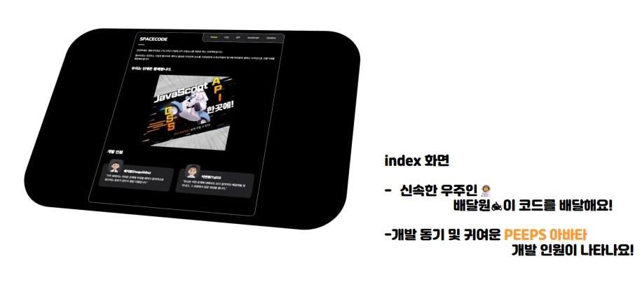
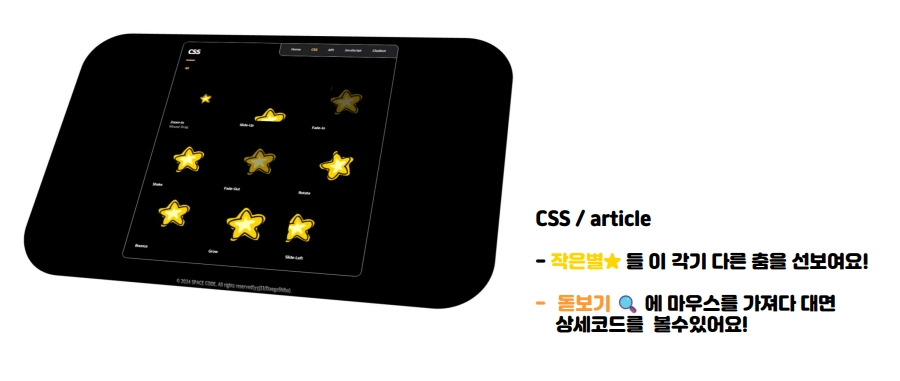
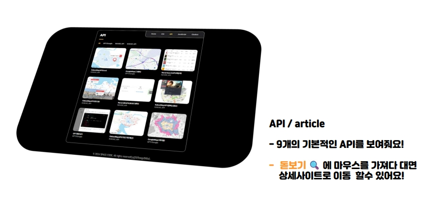
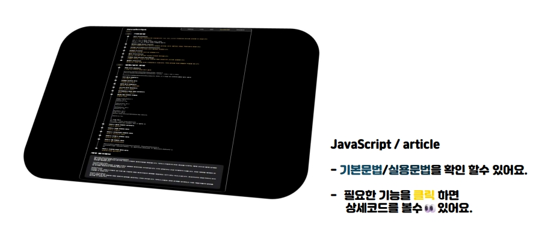

# SPACECODE - (Demo)WEBSITE


## [SPACE코드 바로가기](https://spacecode-website.netlify.app "SPACE코드 바로가기")

> SPACECODE는 **무료**로 **로그인 없이** 사용할 수 있는 프론트엔드 지원서비스입니다.  
> **프론트엔드**로 웹 개발에 대한 **기초**를 다지려 노력했습니다.  
> **지속가능한** 프로젝트를 목표로 준비중이며,
>  저희들이 많은 **성장**을 거듭할 수 있었던 프로젝트 입니다.
> 

### 목차
[SPACECODE에 대하여!](#spacecode-web은-이런걸-할-수-있어요)
<br>*[SPACECODE의 목표!](#spacecode는-풀스택으로-거듭날-예정예요)
<br>*[설치 전 확인사항!](#확인해주세요)
<br>*[SPCAECODE 저장하는법?!](#spacecode-저장방법)
<br>*[귀여운 아바타 생성](#자신의-캐릭터-생성)

## SPACECODE WEB은 이런걸 할 수 있어요!🧑‍🚀











## SPACECODE는 풀스택으로 거듭날 예정예요!
<br>저희 웹사이트는 현재 프론트엔드에서는 HTML, CSS, JavaScript를, 백엔드에서는 Node.js와 MySQL을 사용하여 구축되어 있습니다. <br> 이렇게 구성된 기술 스택은 웹사이트의 안정성과 효율성을 보장하며, 사용자에게 최상의 경험을 제공합니다.

저희 팀은 기술의 발전과 함께 성장하는 것을 중요하게 생각합니다. 
<br>그래서 저희 팀은 현재 React와 Next.js를 학습하고 있으며, 이를 프로젝트에 통합할 계획입니다. <br>
이야기한 기술은 현대 웹 개발의 핵심 요소로, 이를 통해 웹사이트의 성능을 향상시키고, 사용자 경험을 더욱 풍부하게 만들 것 이라 확신하고 있습니다.

앞으로의 활동 방향은 이러한 새로운 기술을 저희 웹사이트에 통합하고, 이를 통해 사용자에게 더 나은 서비스를 제공하는 것입니다. 또한, 저희는 기술의 변화와 시장의 트렌드를 계속해서 주시하며, 필요한 경우 새로운 기술을 도입할 준비가 되어 있습니다. <br>저희의 목표는 항상 최신 기술을 통해 최고의 서비스를 제공하는 것입니다.
<br> 이를 통해 저희 웹사이트는 계속해서 발전하고, 사용자에게 가치를 제공할 것입니다. <br>이러한 저희의 노력을 통해, 저희 웹사이트는 더욱 성장하고, 사용자에게 더 나은 경험을 제공할 것입니다.<br> 감사합니다.


## 확인해주세요!

시작하기 전에 다음 요구 사항을 충족했는지 확인하십시오:

* [Git](https://git-scm.com/downloads "Download Git") 운영 체제에 설치해야 합니다.

## SPACECODE 저장방법!

**FE**을(를) 설치하려면 다음 단계를 수행합니다:
Linux and macOS:

```bash
sudo git clone https://github.com/koreaXCO/Style-Website-DemoVersion.git
```

Windows:

```bash
git clone https://github.com/koreaXCO/Style-Website-DemoVersion.git
```
## 자신의 캐릭터 생성
* [아바타제작](https://peeps.ui8.net/ "캐릭터를 생성!")

## License

MIT

## Outro

> 저희 FE웹사이트의 리드미의 가장 아래까지 봐주셔서 정말 감사합니다😊  
